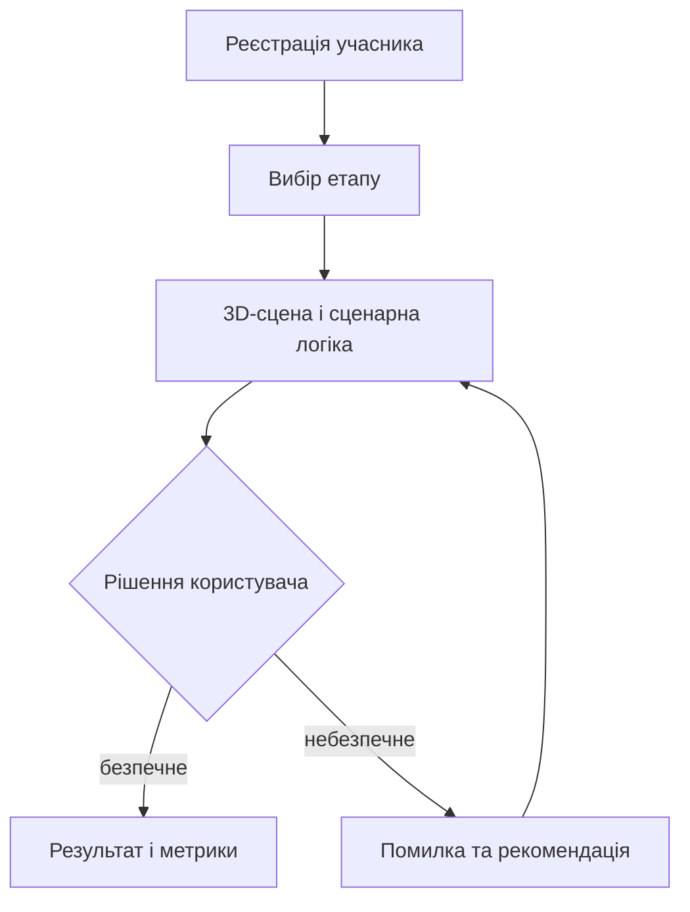

# «Безпечне місто» — браузерний 3D-тренажер

Інтерактивний навчальний тренажер із безпечної поведінки в міському середовищі під час мінної, повітряної та вогневої загрози. Користувач вільно пересувається 3D-сценою, розпізнає небезпеки, обирає алгоритм дій і отримує результат із вимірюваними показниками проходження.

**Онлайн-версія:** [deafinicio.github.io/city-safety-trainer](https://deafinicio.github.io/city-safety-trainer/)

> [!IMPORTANT]
> Це навчальна програмна симуляція. Вона не замінює офіційні інструкції ДСНС, Національної поліції, місцевих органів влади або очне навчання сертифікованими фахівцями.

## Основні можливості

- 11 самостійних навчальних етапів і окремий наскрізний тестовий маршрут.
- Вільне пересування від першої особи.
- Керування з клавіатури, мишею та сенсорним джойстиком.
- Фізичні колізії персонажа з будівлями, деревами, лавками, знаками й іншими перешкодами.
- Сценарні зони небезпеки, контроль дистанції, напрямку руху та послідовності дій.
- Негайний зворотний зв’язок після небезпечного рішення.
- Телефонна клавіатура для ручного набору `101`, `102` або `112`.
- Випадкове перемішування варіантів відповідей без повторення позиції правильної відповіді у послідовних питаннях.
- Призупинення сценарного часу під час діалогів, щоб швидкість читання не впливала на результат.
- Звукові сигнали повітряної загрози, БПЛА, стрілянини та зупинки автомобіля.
- Підсумкові метрики: час реакції, дистанція, обраний маршрут, набраний номер та інші показники.
- Реєстрація учасника із серверним збереженням у Supabase.
- Адаптивні графічні профілі для мобільних і настільних пристроїв.

## Навчальні етапи

| № | Етап | Основна навчальна дія |
|---:|---|---|
| 1 | Зруйнований сектор і завали | Не наближатися до боєприпасу та обрати довший безпечніший маршрут. |
| 2 | Дистанційне мінування | Помітити міну, зупинитися, не рухати ногами та набрати номер екстреної служби. |
| 3 | Офіційний знак «МІНИ» | Зупинитися й обійти позначену територію; перетин стрічки завершується помилкою. |
| 4 | Неофіційне попередження | Розпізнати непрямі ознаки, попередити інших, повернутися на безпечну відстань і зателефонувати. |
| 5 | Зворотна сторона знака | Не шукати вихід навмання, залишитися на місці, набрати номер і правильно передати інформацію оператору. |
| 6 | Покинутий рюкзак | Не торкатися предмета, відійти, набрати номер і правильно передати інформацію оператору. |
| 7 | Автомобіль у мінному полі | Залишитися в салоні, не продовжувати рух і повідомити екстрену службу. |
| 8 | Повітряна загроза у дворі | Негайно бігти до під’їзду, а після звуку критичного наближення КАБу — зупинитися й лягти. |
| 9 | Скляна зупинка та БПЛА | Відійти від скла й дістатися мобільного укриття до наближення рухомого БПЛА. |
| 10 | Стрілянина на перехресті | Припинити рух, лягти та повзти до нижчої захисної позиції. |
| 11 | Правило двох стін | Відійти від вікон і зовнішніх стін до внутрішньої частини будівлі. |

### Окремий тестовий маршрут «Прогулянка містом»

Тестовий етап об’єднує в одному просторі 120×80 м три послідовні сектори: міську магістраль, парк на межі зруйнованого кварталу та житловий двір із під’їздом. Маршрут містить покинутий рюкзак, ударний і FPV-дрони, укриття за бордюром, офіційні й неофіційні мінні попередження, ПФМ-1, нерозірваний боєприпас у завалах, загрозу КАБу та фінальну захищену зону за двома стінами.

Цей модуль має власні контрольні точки: після помилки кнопка **«Повторити епізод»** повертає користувача до початку поточної ситуації, не перезапускаючи весь маршрут. Тестовий етап навмисно не входить до статистики основних етапів 1–11 у Supabase.

## Керування

### Комп’ютер

| Дія | Клавіша або пристрій |
|---|---|
| Рух уперед, назад, ліворуч і праворуч | `W`, `A`, `S`, `D` або клавіші зі стрілками |
| Огляд | рух миші після натискання на ігрову сцену |
| Контекстна дія | `E` або кнопка дії на екрані |
| Вибір відповіді / набір номера | кнопки в діалоговому вікні |
| Вихід з етапу | кнопка **«Вийти»** |

Керування рухом використовує фізичні коди клавіш (`KeyboardEvent.code`), тому працює незалежно від активної мовної розкладки.

### Сенсорний пристрій

- Ліва частина екрана — віртуальний джойстик руху.
- Права частина — огляд жестом.
- Контекстна дія виконується окремою екранною кнопкою.
- На етапі 7 рух вимкнений, оскільки користувач перебуває в салоні автомобіля.

## Як працює тренажер



Кожен етап є окремим модулем. Модуль створює сцену, встановлює початковий стан, відстежує дії користувача та завершує сценарій успіхом або помилкою. Спільний клас `TrainingWorld` відповідає за рендеринг, фізику, керування, звук, діалоги та життєвий цикл сцени.

## Технології

| Компонент | Призначення |
|---|---|
| HTML5 і CSS | інтерфейс, реєстрація, HUD, діалоги та адаптивне оформлення |
| JavaScript ES Modules | логіка застосунку й навчальних етапів |
| [Three.js 0.186.0](https://threejs.org/) | 3D-рендеринг, освітлення, матеріали та завантаження glTF/GLB |
| [Rapier 0.20.0](https://rapier.rs/) | фізичний світ, капсула персонажа та колізії |
| Web Audio API | процедурні сигнали й звукові ефекти |
| Supabase REST API | збереження реєстрацій учасників |
| GitHub Pages | статичне розгортання застосунку |

Проєкт не використовує npm-збірку, bundler або серверний застосунок. Залежності Three.js і Rapier завантажуються як ES-модулі через CDN.

## Графічна система

Рендерер використовує:

- `ACESFilmicToneMapping`;
- м’які тіні `PCFSoftShadowMap`;
- `GTAOPass` на високому профілі;
- легкий `UnrealBloomPass`;
- PBR-матеріали `MeshStandardMaterial` і `MeshPhysicalMaterial`;
- GLB, Draco та KTX2 pipeline;
- процедурні текстури поверхонь;
- адаптивну щільність пікселів і розмір карт тіней.

Доступні три профілі:

| Профіль | Особливості |
|---|---|
| `performance` | нижча щільність пікселів, тіні 1024 px, без GTAO і Bloom |
| `balanced` | середня щільність пікселів, тіні 1024 px, Bloom |
| `high` | щільність пікселів до 2×, тіні 2048 px, GTAO і Bloom |

Профіль обирається автоматично за типом пристрою, обсягом пам’яті, кількістю ядер і налаштуванням зменшення руху. Його також можна примусово встановити параметром URL:

```text
https://deafinicio.github.io/city-safety-trainer/?quality=performance
https://deafinicio.github.io/city-safety-trainer/?quality=balanced
https://deafinicio.github.io/city-safety-trainer/?quality=high
```

## Структура проєкту

```text
city-safety-trainer/
├── assets/
│   └── models/polyhaven/       # оптимізовані GLB-моделі та інформація про ліцензії
├── css/
│   └── style.css               # інтерфейс, HUD, діалоги й адаптивність
├── admin/
│   ├── index.html              # захищений аналітичний дашборд
│   ├── admin.css               # адаптивний дизайн панелі
│   └── admin.js                # Auth, графіки, фільтри та CSV-експорт
├── data/
│   └── scenarios.json          # ранні декларативні дані прототипу
├── js/
│   ├── app.js                  # екрани, UI, результати й навігація між етапами
│   ├── analytics.js            # анонімне збереження результатів проходження
│   ├── config.js               # публічна конфігурація Supabase і версія застосунку
│   ├── game3d.js               # рендеринг, фізика, керування, звук і фабрики об’єктів
│   ├── registration.js         # валідація та надсилання реєстрації в Supabase
│   └── stages/
│       ├── stage01.js
│       ├── ...
│       ├── stage11.js          # окрема логіка одинадцятого етапу
│       └── testCityWalk.js     # наскрізний тестовий маршрут із трьох секторів
├── .nojekyll                   # вимикає обробку Jekyll у GitHub Pages
├── index.html                  # розмітка всіх екранів застосунку
└── README.md
```

`data/scenarios.json` не є джерелом поточної логіки 11 етапів. Актуальні сценарії реалізовані у файлах `js/stages/stageXX.js`.

## Локальний запуск

Через ES Modules і WebAssembly проєкт потрібно відкривати через HTTP-сервер, а не безпосередньо як `file://`.

### Варіант із Python

```bash
git clone https://github.com/deafinicio/city-safety-trainer.git
cd city-safety-trainer
python -m http.server 8080
```

Після запуску відкрийте:

```text
http://localhost:8080/
```

### Варіант із Node.js

```bash
npx serve .
```

Для повноцінного запуску потрібен доступ до інтернету, оскільки Three.js, Rapier і Draco decoder завантажуються з CDN, а реєстрація надсилається до Supabase.

## Реєстрація та Supabase

Форма збирає:

- прізвище;
- ім’я;
- вік від 1 до 120 років;
- стать із визначеного списку;
- згоду на збереження даних.

Імена нормалізуються, перевіряються як Unicode-текст довжиною 2–80 символів. Вік приймає лише ціле число. Після успішної реєстрації випадково створений UUID зберігається у `localStorage` під ключем `city-safety-registration-v1`.

Дані надсилаються POST-запитом до таблиці `participants` через Supabase REST API. Поточний клієнт очікує такі поля:

| Поле | Типове призначення |
|---|---|
| `id` | UUID учасника |
| `surname` | прізвище |
| `first_name` | ім’я |
| `age` | вік |
| `gender` | обраний код статі |

Адреса проєкту та publishable key налаштовуються у `js/config.js`.

> [!CAUTION]
> Publishable key закономірно доступний у браузерному коді й не є серверним секретом. Захист даних має забезпечуватися Row Level Security у Supabase. Для анонімної ролі слід дозволяти лише необхідне додавання запису та не надавати публічне читання, зміну або видалення таблиці учасників.

## Статистика проходження

Кожна спроба етапу записується до `stage_attempts` лише після одного з трьох результатів:

- `success` — етап завершено правильно;
- `failure` — зафіксовано небезпечний алгоритм;
- `abandoned` — користувач вийшов, перезапустив етап або закрив сторінку.

Запис містить номер етапу, номер спроби в поточній сесії, час початку і завершення, тривалість, причину помилки та сценарні метрики. `session_id` об’єднує спроби одного відкриття тренажера. Анонімна роль може лише додавати валідні записи; читання, зміна та видалення їй недоступні.

Відтворювана SQL-схема міститься у `supabase/analytics-schema.sql`.

## Адміністративний дашборд

Панель доступна за адресою `/admin/` і містить:

- ключові показники за 7, 30, 90 днів або весь час;
- активність за днями;
- успішність, кількість помилок і середній час для кожного етапу;
- розподіл учасників за статтю та віковими групами;
- таблиці учасників і всіх спроб;
- фільтри за періодом, етапом та результатом;
- окремий CSV-експорт персональних даних і результатів проходження.

Дашборд використовує Supabase Auth. Auth-користувач отримує доступ лише тоді, коли його підтверджений email окремо внесений до `public.admin_users`. Персональні дані не завантажуються до браузера неавторизованого користувача. `service_role` у клієнтському коді не використовується.

## Додавання нового етапу

1. Створіть модуль `js/stages/stage12.js` за структурою наявних етапів.
2. Реалізуйте об’єкт із полями `id`, `number`, `title`, `shortTitle`, `instruction` і методами `build()`, `reset()` та `update()`.
3. Імпортуйте модуль у `js/game3d.js` і додайте його до колекції `STAGES`.
4. Додайте картку етапу в `index.html`.
5. Зареєструйте кнопку та перехід до наступного етапу в `js/app.js`.
6. Додайте тексти успіху, рекомендації та відображення метрик у `resultContent`.
7. Перевірте колізії, сенсорне керування, повторний запуск, успішну й усі помилкові гілки.

Базовий контракт етапу:

```js
export const stage12 = {
  id: "stage-12",
  number: 12,
  title: "Назва етапу",
  shortTitle: "Коротка назва",
  instruction: "Початкова інструкція.",

  build(world) {
    // Створення сцени та колайдерів.
  },

  reset(world) {
    // Початкова позиція і world.stageState.
  },

  update(world, delta) {
    // Перевірка поведінки користувача.
  }
};
```

Для завершення використовуються `world.complete(metrics)` і `world.fail(reason, metrics)`. Контекстну дію створює `world.setAction(label, handler)`, а телефонну клавіатуру — `world.openEmergencyDialer(...)`.

## Колізії та фізика

- Персонаж представлений капсулою Rapier.
- Рух обчислюється відносно напрямку камери.
- Увімкнені автоматичний крок на невисокі перешкоди та прилипання до поверхні.
- Статичні об’єкти отримують прямокутні або циліндричні колайдери.
- Межі кожного етапу додатково закриваються невидимими колайдерами.
- Візуальна перешкода може бути навмисно прохідною, якщо це потрібно сценарію. Наприклад, стрічка на етапі 3 дозволяє зафіксувати саме помилкове рішення користувача.

## Розгортання на GitHub Pages

Застосунок повністю статичний і публікується без етапу збірки:

1. Відкрийте **Settings → Pages** у репозиторії GitHub.
2. Оберіть **Deploy from a branch**.
3. Встановіть гілку `main` і каталог `/ (root)`.
4. Після зміни JavaScript або CSS оновіть параметр версії відповідного ресурсу в `index.html` або імпорті, щоб браузери не використовували застарілий кеш.

Файл `.nojekyll` має залишатися в корені репозиторію.

## Перевірка перед публікацією

- Реєстрація відхиляє порожні та некоректні значення.
- Після успішної реєстрації відкривається список етапів.
- `WASD` працює з будь-якою мовною розкладкою.
- Рух відповідає поточному напрямку камери.
- Мобільний джойстик і сенсорний огляд не конфліктують.
- Неможливо пройти крізь тверді об’єкти, якщо це не передбачено сценарієм.
- Кожна небезпечна дія видає правильну причину помилки.
- Кожен етап можна повторити без стану від попередньої спроби.
- Телефонна клавіатура приймає всі дозволені номери.
- Варіанти відповідей перемішуються окремо для кожного питання.
- Профілі `performance`, `balanced` і `high` запускаються без помилок консолі.
- GLB-моделі та CDN-залежності успішно завантажуються через HTTPS.

Для швидкої синтаксичної перевірки JavaScript:

```bash
node --check js/app.js
node --check js/game3d.js
node --check js/registration.js
node --check js/analytics.js
node --check admin/admin.js
for file in js/stages/*.js; do node --check "$file"; done
```

## Відомі обмеження

- Візуальна частина поєднує процедурну геометрію та окремі GLB-ресурси; вона ще не відповідає рівню сучасної AAA-гри.
- Застосунок не має повноцінного офлайн-режиму.
- Звук залежить від Web Audio API та політики автовідтворення браузера.
- Початкова реєстрація потребує доступності Supabase.
- Аналітика починає накопичуватися лише з версії, у якій додано `stage_attempts`; попередні проходження відновити неможливо.
- Автоматизовані end-to-end тести наразі відсутні.

## 3D-ресурси та ліцензії

Моделі в `assets/models/polyhaven/` отримані з [Poly Haven](https://polyhaven.com/) і поширюються за ліцензією [CC0 1.0](https://creativecommons.org/publicdomain/zero/1.0/). Деталі наведені у файлі `assets/models/polyhaven/README.md`.

Окрему ліцензію для програмного коду репозиторію поки не додано. До появи файлу `LICENSE` стандартні правила GitHub не надають автоматичного дозволу на копіювання, модифікацію або розповсюдження коду.

## Репозиторій

[github.com/deafinicio/city-safety-trainer](https://github.com/deafinicio/city-safety-trainer)
